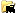
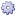
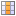

Introduction
============

Kase Format 2.1.1
-----------------

This document describes the data structures and its hierarchical organization for writing and reading a kase file. The information described here does not include all data present in a numerical study, but should be sufficient for defining external interfaces for most cases.

The kase hierarchy described here can be used to define simulation models, as an output of a pre processor, and also the transient results of a numerical solution, with some special data structures to represent data for reservoir models and simulations.

An important note is that the kase hierarchy, as defined in this document, is a definition of a set of data structures organization. The file format that supports this hierarchy can be of any type. This document will cover two file formats to represent the kase hierarchy, an HDF_ binary file and an XML ASCII file.

.. _HDF: http://hdf.ncsa.uiuc.edu/HDF5/doc/index.html

.. contents:: Contents
	:depth: 3
	:backlinks: top
	
	
Testing.	

Overview
========

The kase file is a hierarchical data structure that describes how to write numerical simulation data into files. The relationship between the data can be defined in two ways: a child parent and a cross reference as described below.

The child parent relationship, which is used for:

	**Data association**, information is associated with a specific entry. 
		E.g.: The "Pressure" and "Flow" grid properties are associated with the parent grid node.
			**GridPart_${Id}:**
				**StaticGridFunctions:**
					**GridFunction_${Id}:** name = "Pressure"
					
					**GridFunction_${Id}:** name = "Flow"
					
	**Classify the types**, to group a collection of a specific data type, like a set of grids.
		E.g.: All children of **GridParts** must be a grid.
			**GridParts:**
				**GridPart_${Id}:** name = InnerVolume
					*Grid part data definition* 
				**GridPart_${Id}:** name = EastBoundary 
					*Grid part data definition*
				
	**Define scopes**, to organize the information in a consistent way.
		E.g.: All children of **TransientInfo** have a well defined transient context.
		
			**TransientInfo:** 
				**time_${time}:** delta = 10.0 days
					**GridParts:**
						*Transient grid part information*

A cross reference system, that has specific semantics to create a well defined ``target reference`` relationship.

The type’s classifiers groups, as mentioned above, are well known kase types which specify that child elements must be of a given type. For each type classifier we have a specific child naming rule, that consists of a prefix ending with an underscore and an integer suffix that represents an ordered index starting at 0 until the child count minus 1.

E.g.: All child of the classifier group **GridParts** have a **GridPart_** prefix and an indexed integer suffix.
 
	**GridParts:**
		**GridPart_0:** name = InnerVolume
			*Grid part data definition* 
		**GridPart_1:** name = EastBoundary 
			*Grid part data definition*
		**GridPart_N:** name = ...
			*Grid part data definition*

This semantics rule creates an easy to use indexing system that allows other data structure to have a strong reference to that element.

E.g.: A grid part can be a child grid of another one.

	**GridPart_N:** name = ...
		- parent_grid_id = 0 (attribute type: integer)

Data Types
==========

The kase data structure has three major types of data:

	- Classifiers: A root grouping node for a specific data type.
	- Arrays: A leaf node for describing a large amount of data
	- Attributes: Defining semantic information about a given group.

Summary of the Kase Hierarchy
=============================

The tree below shows the main data structures supported by the kase hierarchy and it's hierarchical organization.

Kase Study
----------

It's the tree root node that groups all information regarding a specific case. All data representation must be beneath this node, that store global information about the case.

**\\Root:**
	The standard root node.
	
	**\\KaseStudy**:
		The grouping root node for all information regarding a specific problem.
	

Kase Grids
----------

**\\Root:**

	**\\KaseStudy**:

		**\\GridParts:** classifier group for the grid parts
		
			**\\GridPart_${id}:** a grid part instance
			 
				**\\Geometry:** the grid part geometry
				
				**\\Topology:** the grid part topology
	
				**\\GridFunctions:** classifier group for the grid functions
				
					**\\GridFunction_${id}:** a grid function instance
					
		**\\Views:** classifier group node for parametric grid part definition
		
			**\\Zones:** a domain decomposition for a grid in zones
				
				**\\Zone_${id}:** a zone instance, for a specific grid
			
			**\\Blocks:** a structured IJK block view
			
				**\\Block_${id}:** a block instance, for a specific grid
				
			**\\Regions:** a generic domain decomposition by an property range clipping.
		
				**\\Region_${id}:** a region instance, for a specific grid
				
			**\\Selections:** generic domain decomposition by explicitly selecting each cell in the domain
		
				**\\Selection_${id}:** a selection instance, for a specific grid
		
		
		**\\NNCs:** classifier group for NNC (non-neighborhood connection) 
					
			**\\NNC_${id}:** a NNC (non-neighborhood connection) instance
			 
				**\\GridFunctions:** classifier group for the grid functions
				
					**\\GridFunction_${id}:** a transient grid function instance

			
Kase Log
--------

Discrete functions data structure

**\\Root:**

	**\\KaseStudy**:
	
		**\\LogData:** classifier group node for defining a set of discrete functions.
		
			**LogDataSet_${id}:** a discrete log data set instance
			 
			**\\Log_${id}:** a discrete function instance defining a data set for its image and domain.
	
				
		**\\TransientLog:** a special type of log where the domain is implicitly defines as time.
		 
			**\\LogImage_${id}:** a discrete image instance

Simulation Well Data
--------------------

A grouping node for the simulation well information 

**\\Root:**

	**\\KaseStudy**:
	
		**\\WellField:** classifier group node and also the well hierarchy group root
		
			**\\Groups:** classifier group for the well groups 
			
				**\\Group_${id}:** a well group instance 
	
			**\\Wells:** classifier group for the wells 
			
				**\\Well_${id}:** a well instance
				
			**\\Completions:** classifier group for the well's completions
			
				**\\Completion_${id}:** a completion instance
			

Transient Sections
------------------

It's a tree node that groups all recurrent timesteps definitions
			
**\\Root:**

	**\\KaseStudy**:
	
		**\\TransientSections:**: classifier group for all recurrent transient data
			
			**\\Timestep_${id}:** a group node for the recurrent timestep information
		 
				**\\GridParts:** changes in the grid parts definition (transient grid function values)
				
				**\\Views:** changes in the grid parts views
				
				**\\NNCs:** changes in the NNC definition (Non Neighbour Connection)(transient grid function arrays)
				
				**\\LogData:** new discrete function log definitions 
				
				**\\TransientLog:** log image data definition 
		
				**\\WellField:** changes in the well field structure (parent changes, state changes, etc.)
		 
				
How to read this document
=========================

We use icons to identify some behavior or characteristic for each data entry in the file. Here is a list of these symbols and its description:

Classification
--------------

Each entry in kase data structure has a generic type, like a group node an attribute. Bellow we give a description of these generic types and its meaning.

.. _folder_help: 

|folder|: *group node* - a classifier grouping node with a fixed label that identify/classify its child elements.

E.g: 
	|folder| **\\GridParts:**
		The grouping node for all grid parts defined in the simulation model

.. _folder_target_help:

|folder_add|: *multiple entry node* - a grouping node with a label defined by an integer index. The data type is defined by its parent, and is used by other data structures as a reference to this data. This element can have multiple definitions.

E.g.: 
	|folder| **\\GridParts:**
		|folder_add| **\\GridPart_${id}:**
			**A grid part with id = ${id}**
 
.. _attr_help:

|attr|: *attribute* - a node attribute 

E.g.: 
	|folder| **\\GridParts:**
		|folder_add| **\\GridPart_${id}:**
			|attr| ``name:``
				**the human-readable name for the grid**

.. _array_help:

|array|: *array* - an array of values  

E.g.: 
	|folder| **\\GridParts:** 
		|folder_add| **\\GridPart_${id}:**
			|folder| **\\GridFunctions:**
				|folder_add| **\\GridFunction_${id}:**
					A grid function with id = ${id}
					
					|array| ``values:``
						**an array with values for the grid function**

Presence
--------

Some data must be defined in the file and others are optional. The following icons describe the presence statement for each data.

.. _required_help: 

|required|: *required* - the data must be defined, its presence is mandatory.

.. _optional_help: 

|optional|: *optional* - the data can be defined, its presence is optional but recommended. Some optional attributes have a default value defined by the sentence following the item:

	+ **DEFAULT:** ${default value} 
 
E.g.: The grid part attribute `name` is optional but the attribute `type` must be defined.

	|folder| **\\GridParts:** 
		|folder_add| **\\GridPart_${id}:**
			|attr| ``name:`` [|optional|]
				**the human-readable name for the grid**
				
			|attr| ``type:`` [|required|]
				**the grid type: [unstructured, structured, reservoir]**
						
Time Dependency
---------------

Kase data structure has some restrictions on what can be created and changed over the time. The following icons are used to classify if the data can be defined and changed on recurrent transient sections.

.. _static_help:
 
|static|: *static information* - means that this entry is static. It can be defined in recurrent transient sections, but not modified.

E.g.: The grid part attribute `name` can be defined in the recurrent transient sections, since the GridPart_${0} group is transient, but cannot be modified oncedefined.

	|folder| **\\GridParts:** [|transient|]
		|folder_add| **\\GridPart_0:** [|transient|]
			|attr| ``name:`` [|static|]
				**the human-readable name for the grid**

.. _transient_help: 

|transient|: *transient information* - means that this entry is transient. It can be defined and modified in recurrent transient sections.

E.g.: The user can define new grid parts, and also change the ones defined.
	|folder| **\\GridParts:** [|transient|]
		|folder_add| **\\GridPart_0:** [|transient|]
			
Cross Reference System
----------------------

.. _link_help:

|link|: *link target* - the element is a target reference, and can be linked to other data structures.

.. _link_ref_help:
 
|link_ref|: *link reference* - the element is a reference to other data structure.

-----

Kase Data Structure
===================

|folder| **\\Root:**

	|attr| ``VERSION_MAJOR:`` [|required|, type: int]
		file major version  
	|attr| ``VERSION_MINOR:`` [|required|, type: int]
		file minor version  
	|attr| ``VERSION_REVISION:`` [|required|, type: int]
		file version revision  
		
	|attr| ``file_strategy:`` [|optional| type: int, default: 0]
		an integer attribute that specifies if the data is stored in multiple files or not.
		
		- 0 = single
		- 1 = multiple
	
	.. _KaseStudy:
	
	|attr| ``multiple_file_suffix:`` [|optional| type: str, default: ".k_"]
		If file_strategy is ``multiple``, the suffix of the transient files can be specified. The 
		time_step_id will be appended to the suffix, so by default the file "file.kase" will have
		as transient the files "file.k_00000", "file.k_00001", and so on. 
		
	|folder| **\\KaseStudy:** [|required|, `HDF Group`_, `XML Group`_]
	
		Group node with information about the file.
		
		|attr| ``data_strategy:`` [|required|, type: str, `HDF Attribute`_, `XML Attribute`_]
			defined the strategy used to write data into the file. It can be of two types:
				- `"post":` optimized file data structure for post processing
				- `"simulator":` suited to be used for output from a simulator
				
		|attr| ``appendix_of:`` [|optional|, type: str, `HDF Attribute`_, `XML Attribute`_]
			defines the file name to which this kase study is appending information to
				
		|attr| ``name:`` [|optional| type: str, `HDF Attribute`_, default: ""]
			a cultural long name for the kase study in this file which can be shown in user interface.
			
		|attr| ``nickname:`` [|optional| type: str, `HDF Attribute`_, default: ""]
			a cultural short name for the kase study in this file which can be shown in user interface.
			
		|attr| ``description:`` [|optional| type: str, `HDF Attribute`_, default: ""]
			a cultural description for the kase study in this file which can be shown in user interface.
			
		|attr| ``software_name:`` [|optional| type: str, `HDF Attribute`_, default: ""]
			the name of the software that originally created this file.
		
		|attr| ``software_description:`` [|optional| type: str, `HDF Attribute`_, default: ""]
			a short description for the software that originally created this file.
		
		|attr| ``vendor_name:`` [|optional| type: str, `HDF Attribute`_, default: ""]
			the name of the manufacturer or vendor that created this file.
		
		|attr| ``vendor_description:`` [|optional| type: str, `HDF Attribute`_, default: ""]
			a short description of the manufacturer or vendor that created this file.
			
		
		**For Time Set Shift**

        |attr| ``time_set_shift_value:`` [|optional| type: float, `HDF Attribute`_]
        |attr| ``time_set_shift_unit:`` [|optional| type: str, `HDF Attribute`_]
            a pair of delta value and unit that if defined cause all time sets contained by the kase study to shifted
            accordingly. Used for scenarios where big kase files contain time sets with a wrong initial date, but
            regenerating whole file could be too expensive. This pair of option offer a cheap alternative to fix
            files in this situation.	
		
		
		**For Dual Porosity / Dual Permeability Models**

			.. _dpdk:

			|attr| ``dpdk:`` [|optional| type: int, `HDF Attribute`_, default: 0]
				an integer attribute that identifies a dual porosity / dual permeability model.
				
				- 0: single porosity single perameability model
				- 1: dual porosity single permeability model
				- 2: dual porosity dual permeability model.
				
		|folder| **\\Phases:** [|optional|, `HDF Group`_, `XML Group`_]

			Definition of the simulation phases
				
		.. _phase_id:
	
			|folder| **\\Phase_${id}:** [|required| |link_ref|, `HDF Group`_, `XML Group`_]
		
				|attr| ``name:`` [|required| type: str]
					the phase name
			
				|attr| ``description:`` [|optional| type: str, default: ""]
					the phase description
			
				see: `Known Phases`_:
				
			
		|folder| **\\Components:** [|optional|, `HDF Group`_, `XML Group`_]
				
			Definition of the simulation phase components

			.. _component_id:
	
			|folder| **\\Component_${id}:** [|required| |link_ref|, `HDF Group`_, `XML Group`_]
		
				|attr| ``name:`` [|required| type: str, `HDF Attribute`_]
					the component name
			
				|attr| ``description:`` [|optional| type: str, `HDF Attribute`_]
					the component description
			
				|attr| ``phase_id:`` [|optional| |link|, type: int]
					an integer value identifying the component's phase.
					
		.. _GridParts:
	
		|folder| **\\GridParts:** [|optional| |transient| `HDF Group`_]
	
			.. _grid_id:
	
			|folder_add| **\\GridPart_${id}:** [|required| |link| |transient| `HDF Group`_]
				Defines a new grid in the file. The group name must be defined by the prefix "GridPart\_" and an integer suffix.
				
				|attr| ``name:`` [|required| |static| type: str, `HDF Attribute`_]
					the human-readable name for the grid
				
				|attr| ``description:`` [|optional| type: str, `HDF Attribute`_, default: ""]
					a cultural description for the grid
					
				.. _grid_type:
				
				|attr| ``type:`` [|required| |static| type: string, `HDF Attribute`_]
					the grid type can be: ["unstructured", "structured", "reservoir"]
					
				.. _grid_role:

				|attr| ``grid_role:`` [|required| |static| type: str, `HDF Attribute`_]
					The grid role is a cultural information that defines a role for this grid part in a model.
					For known roles by current Kase specification, see `Known Grid Roles`_.

				.. _parent_grid_id:
				
				|if| **IF** (grid_role_ == "LGR") **:**
				
					|attr| ``parent_grid_id:`` [|required| |link_ref| |static| type: int, `HDF Attribute`_]
						the parent grid_id_ hosting this grid
	
				|if| **IF** (dpdk_ == 1 or 2) **:**
	
					|attr| ``dpdk_grid_role:`` [|required| |static| type: str, `HDF Attribute`_]
						the grid role in a Dual Porosity Dual Permeability Model
						a selection from: ['N/A', 'MATRIX', 'FRACTURE']
					
					|attr| ``dpdk_grid_id:`` [|required| |link_ref| |static| type: int, `HDF Attribute`_]
						the DPDK sibling grid_id_
	
				|folder| **\\Topology:** [|required| |transient| `HDF Group`_]
					Group node for all information that defines the grid topology
					 
					|attr| ``shared_topology_reference_id::`` [|optional| |link_ref| |static| type: str, `HDF Attribute`_]
						if specified, no other attributes or arrays should be specified, and the topology for this grid should be considered the same topology specified in the referenced grid.
	
					|if| **IF** (grid_type_ == "unstructured" or "structured") **:**
					
						Note: Reservoir Grids are only 3 dimensional

						.. _topological_dimension:
						
						|attr| ``dimension:`` [|required| |static| type: int, `HDF Array`_]
							defines the topological dimension. It can be:

							======= =========== ============================== ===================
							 Value   Dimension          unstructured                structured
							======= =========== ============================== ===================
							   0        0D       A cloud of points              Not applicable
							   1        1D       A set of polylines             A polyline
							   2        2D       A set of surfaces of
							                     trias and quads                A surface of quads 
							   3        3D       A set of volumes of tetras,    A volume of hexas
							                     pyras, prisms and hexas    		   
							======= =========== ============================== ===================
								
					|if| **IF** (grid_type_ == "unstructured") **:**

						.. _number_of_elements:
						
						|attr| ``number_of_elements:`` [|required| |transient| type: int, `HDF Attribute`_]
							the total number of elements
							
						.. _elements_vertices:
						
						|array| ``elements_vertices:`` [|required| |transient| type: int, `HDF Array`_]
							an array of integers defining all elements' vertices. The elements are represented
							one after the other by the number of vertices and the index of each vertex, according to
							the sequence of vertices defined in the Elements_Topology_ section.
							   
							+ E.g.: "**3** `2 3 0` **4** `3 4 1 0` **3** `5 3 2` **4** `5 6 4 3`"
									|elements_vertices_eg|

						|array| ``elements_positions:`` [|required| |transient| type: int, `HDF Array`_]
							an array of integers, with size equal to the total number of elements, defining
							the element's initial position in the elements_vertices_ array.

							+ E.g.: "0 4 9 13"

					|if| **IF** (grid_type_ == "reservoir" or "structured") **:**
					
						|if| **IF** (topological_dimension_ == 1) **:**
						
							|attr| ``ni:`` [|required| |static|, type: int, `HDF Attribute`_]
								the number of cells in topological I direction
							
						|if| **IF** (topological_dimension_ == 1 or 2) **:**

							|attr| ``nj:`` [|required| |static|, type: int, `HDF Attribute`_]
								the number of cells in topological J direction
							
						|if| **IF** (topological_dimension_ == 1 or 2 or 3) **:**

							|attr| ``nk:`` [|required| |static|, type: int, `HDF Attribute`_]
								the number of cells in topological K direction
						
					|if| **IF** (grid_type_ == "reservoir") **:**
					
						.. _number_of_active_cells:
					
						|attr| ``number_of_active_cells:`` [|optional| |static|, type: int, default: `NI*NJ*NK`, `HDF Attribute`_]
							the number of active cells
						
						|array| ``actnum:`` [|optional| |static| type: int, default: `all active`, `HDF Array`_]
							an array of integers for each grid cell defining the active cells (1 active, 0 inactive)
					
					|if| **IF** (parent_grid_id_ is defined) **:**
					
						|array| ``hostnum:`` [|required| |static| type: int, `HDF Array`_]
							an array of integers for each grid cell defining the parent cell handle.
					
				|folder| **\\Geometry:** [|required| |transient| `HDF Group`_]
					Group node for all information that defines the grid geometry 
	
					|attr| ``shared_geometry_reference_id:`` [|optional| |link_ref| |static| type: int, `HDF Attribute`_] 
						if specified, no other attributes/arrays should be specified.
						This grid will share it's geometry with the grid identified by the given id.
	
					|array| ``basis:`` [|required| |transient| type: float, `HDF Array`_]
						A floating point array with the geometry basis.
						The elements in the array must follow the order: origin, x, y and z axis.
						For a three dimensional geometry this array has twelve elements.
						
                    |attr| ``invert_y_axis:`` [|optional| |static| default: 0, type: int, `HDF Attribute`_]
                        an integer value defining if the geometry should be flipped around the X axis.
                        The Y and Z axis will be inverted.
                        
					|array| ``bounding_box:`` [|optional| |transient| type: float, `HDF Array`_]
						A floating point array with the geometry bounding box.
						The elements in the array must follow the order: x min and max, y min and max and z min and max.
						For a three dimensional geometry this array has six elements.
						
                    |attr| ``transient:`` [|optional| |static| default: 0, type: str, `HDF Attribute`_]
                        an integer value that identifies a transient geometry.

                        + 0 = static
                        + 1 = transient

					|attr| ``quantity_unit:`` [|required| |static| type: str, `HDF Attribute`_]
						the unit for the geometry points
					
					|if| **IF** (grid_type_ == "unstructured" or "structured") **:**
					
						.. _geometric_dimension:
						
						|attr| ``dimension:`` [|required| |static| type: int, `HDF Attribute`_]
							geometric dimension:
								- 1 = 1D 
								- 2 = 2D 
								- 3 = 3D 
						
							**Note:** Reservoir Grids are implicitly defined as 3 dimensional
							 
					.. _unstructured_geometry:
					
					|if| **IF** (grid_type_ == "unstructured") **:**
					
						.. _number_of_points:
					
						|attr| ``number_of_points:`` [|optional| |static| type: int, `HDF Attribute`_]
							The number of points.
					

						|if| **IF** (geometric_dimension_ == 1) **:**
						
							|array| ``x:`` [|required| |transient| type: float, `HDF Array`_]
								The X geometry points coordinates with size == number_of_points_
							
						|if| **IF** (geometric_dimension_ == 2) **:**

							|array| ``xy:`` [|required| |transient| type: float, `HDF Array`_]
								An array of float (X, Y) tuples, in this sequence, with size = 2 * number_of_points_
							
						|if| **IF** (geometric_dimension_ == 3) **:**

							|array| ``xyz:`` [|required| |transient|, type: float, `HDF Array`_]
								An array of float (X, Y, Z) tuples, in this sequence, with size = 3 * number_of_points_
							
					.. _structured_geometry:

					|if| **IF** (grid_type_ == "structured") **:**
					
						|if| **IF** (geometric_dimension_ == 1) **:**

							|array| ``x:`` [|required| |static|, type: float, `HDF Array`_]
								The X geometry coordinates with size = NI+1.
								
								See: `Structured Data Arrays`_
								
						|if| **IF** (geometric_dimension_ == 2) **:**

							|array| ``xy:`` [|required| |static|, type: float, `HDF Array`_]
								An array of float (X, Y) tuples, in this sequence, with size = 2 * (NI+1)*(NJ+1).

								See: `Structured Data Arrays`_
								
						|if| **IF** (geometric_dimension_ == 3) **:**

							|array| ``xyz:`` [|required| |static|, type: float, `HDF Array`_]
								An array of float (X, Y, Z) tuples, in this sequence, with size = 3 * (NI+1)*(NJ+1)*(NK+1).

								See: `Structured Data Arrays`_

					|if| **IF** (grid_type_ == "reservoir") **:**

					 	.. _reservoir_geometry_type:

						|attr| ``type:`` [|required| |static|, type: int, `HDF Attribute`_]
							Defines the geometry type of a reservoir grid. The kase file supports seven (8) different types of geometry description. A integer value from 1 to 8 will define the reservoir geometry type. The corresponding arrays for each definition are listed below.

						|if| **IF** (reservoir_geometry_type_ == 1) **:**
							
							.. image:: images/geometry_type1.jpg

							|array| ``cell_size:`` [|required| |static|, type: float, `HDF Attribute`_]
								A 1D array with the cell size in X, Y and Z direction

						|if| **IF** (reservoir_geometry_type_ == 2) **:**

							.. image:: images/geometry_type2.jpg
							
							The reservoir grid geometry type 2 can be described by two different array types.
							
							- Delta arrays for each direction dx, dy or dz with size = NI, NJ or NK
							
							- Explicit coordinate arrays for each direction x_coord, y_coord or z_coord with size = NI+1, NJ+1 or NK+1
							
							**Delta**:
								|array| ``dx:`` [|required| |static|, type: float, `HDF Array`_]
									A 1D array with delta values in topological I direction. The array size is defined by the grid topology size in I direction.
							**Or explicit**:
								|array| ``x_coord:`` [|required| |static|, type: float, `HDF Array`_]
									A 1D array with coordinate values in topological I direction. The array size is defined by the grid topology size in I direction plus 1.

							**Delta**:
								|array| ``dy:`` [|required| |static|, type: float, `HDF Array`_]
									A 1D array with delta values in topological J direction. The array size is defined by the grid topology size in J direction.
							**Or explicit**:
								|array| ``y_coord:`` [|required| |static|, type: float, `HDF Array`_]
									A 1D array with coordinate values in topological J direction. The array size is defined by the grid topology size in J direction plus 1.

							**Delta**:
								|array| ``dz:`` [|required| |static|, type: float, `HDF Array`_]
									A 1D array with delta values in topological K direction. The array size is defined by the grid topology size in K direction.
							**Or explicit**:
								|array| ``z_coord:`` [|required| |static|, type: float, `HDF Array`_]
									A 1D array with coordinate values in topological K direction. The array size is defined by the grid topology size in K direction plus 1.

						|if| **IF** (reservoir_geometry_type_ == 3) **:**

							.. image:: images/geometry_type3.jpg
							
							The X and Y coordinates use the same representation of type 2 geometry, with deltas or explicity arrays defined.
							
							The Z coordinates are described by:
							  
							|array| ``depth_top:`` [|required| |static|, type: float, `HDF Array`_]
								A 3D array with the z coordinate for the top face of the grid cells.

							**Option 1**:
								|array| ``depth_bottom:`` [|required| |static|, type: float, `HDF Array`_]
									A 3D array with the z coordinate for the bottom face of the grid cells.
							**Option 2**:
								|array| ``dz:`` [|required| |static|, type: float, `HDF Array`_]
									A 3D array with the cell size in Z direction.

								The 3D arrays layout and size are described in `Structured Data Arrays`_

						|if| **IF** (reservoir_geometry_type_ == 4) **:**

							.. image:: images/geometry_type4.jpg

							The X and Y coordinates use the same representation of type 2 geometry, with deltas or explicity arrays defined.

							Geometry of type 4 to 7 have a z corner array for each cell vertex. These arrays must be writen independently for each vertex using the same sequence as follows: 

							.. _zcorners:

							|array| ``ZCORNER_${vertex}:`` [|required| |static|, type: float, `HDF Array`_]
								${vertex} will range from 0 untill 7

								See: `Structured Data Arrays`_

						|if| **IF** (reservoir_geometry_type_ == 5) **:**

							.. image:: images/geometry_type5.jpg

							|array| ``coord:`` [|required| |static|, type: float, `HDF Array`_]
								An NJ x NI x [x, y] array with the vertical coord lines for each J, I topological direction.

								The loop sequence must be:
									loop j (0, NJ+1):
										loop i (0, NI+1)
											x, y coordinates

							|array| ``zcorners:`` see: zcorners_ 

						|if| **IF** (reservoir_geometry_type_ == 6) **:**

							.. image:: images/geometry_type6.jpg

							|array| ``coordlines:`` [|required| |static|, type: float, `HDF Array`_]
								An NJ x NI x [top, bottom] x [x, y, z] array with the vertical coord lines for each J, I topological direction.

								The loop sequence must be:
									loop j (0, NJ+1):
										loop i (0, NI+1)
											top (x, y, z) coordinates
											
											bottom (x, y, z) coordinates
											
								.. image:: images/malhas_vertices_type_6.jpg
									:height: 160
									:alt: Coordinate lines (black) that anchor the z cells corners
									:target: images/malhas_vertices_type_6.jpg
									
							|array| ``zcorners:`` see: zcorners_ 

						|if| **IF** (reservoir_geometry_type_ == 7) **:**

							.. image:: images/geometry_type7.jpg

							|array| ``xcorners:`` see: zcorners_ 

							|array| ``ycorners:`` see: zcorners_ 

							|array| ``zcorners:`` see: zcorners_ 

						|if| **IF** (reservoir_geometry_type_ == 8) **:**

							The same arrays with layout and size used for structured geometries. See: structured_geometry_.

					.. _gridfunctions:
	
				|folder| **\\GridFunctions:** [|optional| |transient| `HDF Group`_]
					Group node for the static and transient grid functions associated with the parent grid node.

					.. _gridfunction:
					
					|folder_add| **\\GridFunction_${id}:** [|optional| |transient| |link| `HDF Group`_]
						Defines a new grid function in the grid.
						The group name must be defined by the grid function id, a unique identifier for the grid function

						|attr| ``name:`` [|required| |static| type: str, `HDF Attribute`_]
							the human-readable name for the grid function

						|attr| ``description:`` [|optional| |static|, type: str, `HDF Attribute`_]
							the human-readable short description for the grid function

						.. _grid_function_location:

						|attr| ``location:`` [|required| |static| type: int, `HDF Attribute`_]
							grid function values topological association. It can be be:

							+ 0 = vertex
							+ 1 = edge **NOT SUPPORTED YET**
							+ 2 = face **NOT SUPPORTED YET**
							+ 3 = cell
							+ 4 = nnc **USED IN NNC**

						|attr| ``transient:`` [|required| |static| type: str, `HDF Attribute`_]
							an integer value that identifies a transient grid function.

							+ 0 = static
							+ 1 = transient

						.. _quantity: 

						**Limits**

							The minimum and maximum values for the values array.

							|attr| ``limits_min`` [|optional| |static| type: numeric, default: *calculated*, `HDF Attribute`_]
								grid function minium value.

							|attr| ``limits_max`` [|optional| |static| type: numeric, default: *calculated*, `HDF Attribute`_]
								grid function maximum value.
								
						**Condition**

							Specifies if the grid function is associated to a measure at surface or reservoir conditions.

							|attr| ``condition`` [|optional| |static| type: numeric, default: -1, `HDF Attribute`_]
								+ -1 = unknown
								+  0 = surface
								+  1 = reservoir
								
						**Dimension**

							Specifies the grid function dimension.

							|attr| ``dimension`` [|optional| |static| type: numeric, default: 0, `HDF Attribute`_]
								+ 0 = scalar: 1 scalar for each entry
								+ 1 = vector: N scalars for each entry, where N is the geometry dimension
								+ 2 = tensor: N x N scalar matrix for each entry, where N is the geometry dimension
							
							An optional way to declare the values for a vector or tensor grid function is link each component to another grid function.
							
							*For a vector*
							
							|if| **IF** (geometric_dimension_ == 1) **:**
	
								|attr| ``x_component_id`` [|optional| |static| type: numeric, `HDF Attribute`_]
							
							|if| **IF** (geometric_dimension_ == 2) **:**
	
								|attr| ``y_component_id`` [|optional| |static| type: numeric, `HDF Attribute`_]
							
							|if| **IF** (geometric_dimension_ == 3) **:**
	
								|attr| ``z_component_id`` [|optional| |static| type: numeric, `HDF Attribute`_]
								
								
						**Quantity**

						The quantity is a data structure that has all information to define the grid function role in the problem and also its unit of measure.

						E.g. ``quantity_category:`` "porosity" - is a known property for a reservoir model, and can be defined using a category. Implicitly we can use this information to classify this property as a volume/volume quantity type.

						E.g. ``quantity_category:`` "oil pressure" - is a known property for a reservoir model, and can be defined using a category. A better way to categorize this proeprty is by defining it's type as "pressure" and that its associated to the "oil" phase.

						|attr| ``quantity_unit:`` [|required| |static| type: str, `HDF Attribute`_]
							the unit for the grid function

						*The quantity category can be defined explicitly*

							|attr| ``quantity_category:`` [|required| |static| type: str, `HDF Attribute`_]
								the category for the grid function

								E.g.: "oil pressure"

							see: `Known Categories`_:

						*Or by the following attributes*

							|attr| ``quantity_type:`` [|required| |static| type: str, `HDF Attribute`_]
								the quantity type.

								.. _posc_units: http://www.posc.org/refs/poscUnits20.xml

								see: `POSC Units of Measure Dictionary v2.0`__

								.. __: posc_units_

							*If associated to a phase*

								|attr| ``phase_id:`` [|optional| |link_ref| |static| type: int, `HDF Attribute`_]
									the correspondig phase_id_

							*If associated to a component*

								|attr| ``component_id:`` [|optional| |link_ref| |static| type: int, `HDF Attribute`_]
									the correspondig component_id_

						**Values**

							|if| **IF** (grid_type_ == "unstrutured") **:**

								|array| ``values:`` [|required| |static| type: int, float, `HDF Array`_]
									An 1D array with values for the grid function. The size of the array depends on the grid_function_location_ using the following rule:

									+ *vertex*: size = number_of_points_  
									+ *cell*: size = number_of_elements_  

							|if| **IF** (grid_type_ == "reservoir") **:**

								|if| **IF** (location__ == 1) **:**

									.. __: grid_function_location_

									.. _storage_strategy:

									|attr| ``storage_strategy:`` [|optional| |static| type: int, default: 0, `HDF Attribute`_]
										an integer value that identify storage layout strategy for the grid function values.

										Two layouts strategies are supported:

										+ 0 = complete: all values are defined, for active and inactive values
										+ 1 = packed: only the values for the active cells are stored.

								|array| ``values:`` [|required| |static| type: int, float, `HDF Array`_]
									an 1D array with values for the grid function

									|if| **IF** (storage_strategy_ == 0)

										see: `Structured Data Arrays`_ 

									|if| **IF** (storage_strategy_ == 1) 

										The array size is the number_of_active_cells_ and the sequence of the values remains the same 
										defined at `Structured Data Arrays`_ but the inactive cells are ignored. 

		|folder| **\\GridFunctions:** [|optional| |transient| `HDF Group`_]
			This is a special group defining a collection of additional grid functions for grid parts.
			
			It should be used when appending information to another file:
			
			see: ``appendix_of`` attribute on KaseStudy_

			|folder_add| **\\GridPart_${id}:** [|required| |link| |transient| `HDF Group`_]
				Groups all grid function that will be added to the grid part with grid_id_
				
				|folder_add| **\\GridFunction_${id}:** [|optional| |transient| |link| `HDF Group`_]
					Defines a new grid function in the grid.
					
					see: GridFunction_ definition
			
		.. _Views:

		|folder| **\\Views:** [|optional| |transient| `HDF Group`_]
			Group node for grid part view definition.

			A view is a topological selection from a grid part.

			|if| **IF** (grid_type_ == "reservoir" or "structured") **:**

				|folder| **\\Zones:** [|optional| |transient| `HDF Group`_]
					Group node for creating grid part views as zones. A zone can only be used with structured or reservoir grid parts, since it will define a group of K layers on a grid part.

					|folder_add| **\\Zone_${id}:** [|required| |link| |transient| `HDF Group`_]
						Defines a new zone for a grid part.

						|attr| ``name:`` [|static| type: str, `HDF Attribute`_]
							the human-readable name for the zone

						|attr| ``description:`` [|optional| |static| type: str, `HDF Attribute`_]
							the human-readable short description for the zone

						|attr| ``grid_id:`` [|required| |link_ref| |static| type: int, `HDF Attribute`_]
							the structured or reservoir grid_id_

						|attr| ``k_top_index:`` [|required| |static| type: int, `HDF Attribute`_]
							the K topological start index for the zone.

						|attr| ``k_bottom_index:`` [|required| |static| type: int, `HDF Attribute`_]
							the K topological final index (inclusive) for the zone.

				|folder| **\\Blocks:** [|optional| |transient| `HDF Group`_]
					Group node for creating grid part views as IJK blocks.
					
					A Block can only be used with structured or reservoir grid parts, since it will define an I, J, K boundary to fit the grid part cells 

					|folder_add| **\\Block_${id}:** [|required| |transient| `HDF Group`_]
						Defines a new block for a grid part.

						|attr| ``name:`` [|required| |static| type: str, `HDF Attribute`_]
							the human-readable name for the block.

						|attr| ``description:`` [|optional| |static| type: str, `HDF Attribute`_]
							the human-readable short description for the block.

						|attr| ``grid_id:`` [|required| |link_ref| |static| type: int, `HDF Attribute`_]
							the structured or reservoir grid_id_.

						|attr| ``i_start_index:`` [|required| |static| type: int, `HDF Attribute`_]
							the I topological start index for the block.

						|attr| ``j_start_index:`` [|required| |static| type: int, `HDF Attribute`_]
							the J topological start index for the block.

						|attr| ``k_start_index:`` [|required| |static| type: int, `HDF Attribute`_]
							the J topological start index for the block.

						|attr| ``i_end_index:`` [|required| |static| type: int, `HDF Attribute`_]
							the I topological end index for the block.

						|attr| ``j_end_index:`` [|required| |static| type: int, `HDF Attribute`_]
							the J topological end index for the block.

						|attr| ``k_end_index:`` [|required| |static| type: int, `HDF Attribute`_]
							the K topological end index for the block.

			|folder| **\\Regions:** [|optional| |transient| `HDF Group`_]
				Group node for creating grid part regions. A region can be used with any type of grid parts, since it will select a set of cells that statisfies the region criteria.

				|folder_add| **\\Region_${id}:** [|required| |transient| `HDF Group`_]
					Defines a new region for a grid part.

					|attr| ``name:`` [|required| |static| type: str, `HDF Attribute`_]
						the human-readable name for the region

					|attr| ``description:`` [|optional| |static| type: str, `HDF Attribute`_]
						the human-readable short description for the region

					|attr| ``grid_id:`` [|required| |link_ref| |static| type: int, `HDF Attribute`_]
						the target grid_id_

					|attr| ``grid_function_id:`` [|required| |link_ref| |static| type: int, `HDF Attribute`_]
						the target gridfunctions_
					
					|attr| ``value_min:`` [|required| |static| type: float, `HDF Attribute`_]
						the minimum property value that a cell must have.

					|attr| ``value_max:`` [|required| |static| type: float, `HDF Attribute`_]
						the maximum property value that a cell must have.
						
						
			|folder| **\\Selections:** [|optional| |transient| `HDF Group`_]
				Group node for creating a grid part selection. A selection is defined by explicitly
				indentifying each cell that is part of it by the cell handle. 

				|folder_add| **\\Selection_${id}:** [|required| |transient| `HDF Group`_]
					Defines a new selection of a grid part.

					|attr| ``name:`` [|required| |static| type: str, `HDF Attribute`_]
						the human-readable name for the selection

					|attr| ``description:`` [|optional| |static| type: str, `HDF Attribute`_]
						the human-readable short description for the selection

					|attr| ``grid_id:`` [|required| |link_ref| |static| type: int, `HDF Attribute`_]
						the target grid_id_
						
					|array| ``cells:`` [|required| |static| type: int, `HDF Attribute`_]
						array with the cell handles of the selection.
						
						|if| **IF** (grid_type_ == "reservoir" or "structured") **:**
							Each entry in the array must have 3 components, the (I, J, K) coordinates of the selected cell.
							
						|if| **IF** (grid_type_ == "unstructured") **:**
							Each entry in the array must be the cell handle. 
			

		.. _NNCs:

		|folder| **\\NNCs:** [|optional| |transient| `HDF Group`_]
			Group node for additional topological connectivities information for the grids assembly.

			|folder_add| **\\NNC_${id}:** [|required| |link| |transient| `HDF Group`_]
				Defines a new NNC in the file.

				|attr| ``source_grid_id:`` [|required| |link_ref| |static| type: int, `HDF Attribute`_]
					the source grid_id_.

				|array| ``source_cells:`` [|required| |static| type: int, `HDF Attribute`_]
					an array with the source cell handles in the the source grid.

				|attr| ``target_grid_id:`` [|required| |link_ref| |static| type: int, `HDF Attribute`_]
					the target grid_id_.

				|array| ``target_cells:`` [|required| |static| type: int, `HDF Attribute`_]
					an array with the target cell handles in the the target grid

				|folder| **\\GridFunctions:** [|optional| |transient| `HDF Group`_]
					Group node for the gridfunctions_ associated with the NNC. Have the same data struture defined for a grid part.

		|folder| **\\WellField:** [|optional| |transient| `HDF Group`_]
			Group node for defining the well data and its organization. Kase2 support different types of well hierarchy. The most common one is used in reservoir simulation models where a real situation is modeled by groups, wells and completions in a hierarchical data structure. This group is the root of this hierarchy.

			We support basically three types of entities: Group, Well and Completion.

			.. image:: images/wellfield.jpg

			**Important Note:** This is a special well group. The well field is a well group with an implicit definition for its id. All references made to a group_id = 0 will be associated with this main group.

			|folder| **\\Groups:** [|optional| |transient| `HDF Group`_]
				Group node for defining all well groups in the model.

				.. _group_id:

				|folder_add| **\\Group_${id}:** [|required| |link| |transient| `HDF Group`_]
					Defines a new group in the file. The hdf group name must be defined by the group id, an unique identifier for the log

					**Important Node:** Unlike the other index elements, the well group has an indexing id starting at 1. Since the id = 0 is reserved for the **WellField**.
					
					|attr| ``name:`` [|required| |static| type: str, `HDF Attribute`_]
						the human-readable name for the well group.
				
					|attr| ``description:`` [|optional| |static| type: str, `HDF Attribute`_]
						the human-readable description for the well group.
				
					|attr| ``parent_id:`` [|required| |link_ref| |static| type: int, `HDF Attribute`_]
						the parent group_id_ for this group.
						
			|folder| **\\Wells:** [|required| |transient| `HDF Group`_]
				Group node for defining all wells in the model.
				
				.. _well_id:
				
				|folder_add| **\\Well_${id}:** [|required| |link| |transient| `HDF Group`_]
					Defines a new well in the file. The hdf group name must be defined by an integer index.
					
					|attr| ``name:`` [|required| |static|, type: str, `HDF Attribute`_]
						the human-readable name for the well.
				
					|attr| ``description:`` [|optional| |static|, type: str, `HDF Attribute`_]
						the human-readable description for the well.
				
					|attr| ``parent_id:`` [|required| |link_ref| |transient|, type: int, `HDF Attribute`_]
						the parent group_id_ for this well.

					|attr| ``state:`` [|optional| |transient|, type: int, `HDF Attribute`_]
						the well recurrent state, one of:
							+ -1 = UNKNOWN
							+  0 = SHUT
							+  1 = OPEN
							
					|attr| ``type:`` [|optional| |transient|, type: int, `HDF Attribute`_]
						the well type, one of:
							- -1 = UNKNOWN
							-  0 = INJECTOR
							-  1 = PRODUCER

			|folder| **\\Completions:** [|required| |transient| `HDF Group`_]
				Group node for defining well completions in the model. A completion in a well field is defined by a cell handle in a grid.
				
				.. _completion_id: 
				
				|folder_add| **\\Completion_${id}:** [|required| |link| |transient| `HDF Group`_]
					Defines a new well in the file. The hdf group name must be defined by an integer index.

					|attr| ``name:`` [|optional| |static|, type: str, `HDF Attribute`_]
						the human-readable name for the well completion

						**DEFAULT:** "${WELLNAME} - ${GRIDNAME} (${TOPOLOGICAL_LOCATION_INDEX})"
				
					|attr| ``parent_id:`` [|required| |link_ref| |transient|, type: int, `HDF Attribute`_]
						the parent well_id_ for this well.

					|attr| ``state:`` [|optional| |transient|, type: int, `HDF Attribute`_]
						the completion state, one of:
							+ -1 = UNKNOWN
							+  0 = SHUT
							+  1 = OPEN

						**DEFAULT:** 0 (shut)

					|attr| ``attached_id:`` [|required| |link_ref| |transient|, type: int, `HDF Attribute`_]
						the completion_id_ to which this completion is connected.

					**Location**

					There are two ways for defining a completion in a model. At least one must be defined or both. 

					+ Using a topological reference in a given grid
					+ Specifying a geometric coordinate

					*Topological Reference*

						|attr| ``grid_id:`` [|required| |link_ref| |static| type: int, `HDF Attribute`_]
							the well completion host grid_id_.`HDF Attribute`_

						|attr| ``location:`` [|required| |link_ref| |static| type: int, `HDF Attribute`_]
							the topological element association for the completion. It can be be:

							+ 0 = vertex
							+ 1 = cell

						|if| **IF** (grid_type_ == "reservoir" or "structured") **:**

							|attr| ``element_i:`` [|optional| |static|, type: int, `HDF Attribute`_]
								the well completion I index on the host grid.

							|attr| ``element_j:`` [|optional| |static|, type: int, `HDF Attribute`_]
								the well completion J index on the host grid.

							|attr| ``element_k:`` [|optional| |static|, type: int, `HDF Attribute`_]
								the well completion K index on the host grid.

						|if| **IF** (grid_type_ == "unstructured") **:**

							|attr| ``element_id:`` [|optional| |static|, type: int, `HDF Attribute`_]
								the well completion cell index on the host grid.

					*Geometric Coordinates*
						The geometric coordinates for the completion can be explicitly defined in the file.
						If not defined the coordinates will be the element center. 

						|attr| ``x:`` [|optional| |static|, type: float, `HDF Attribute`_]
							the well completion I index on the host grid.

						|if| **IF** (geometric_dimension_ == 2 or 3) **:**

							|attr| ``y:`` [|optional| |static|, type: float, `HDF Attribute`_]
								the well completion J index on the host grid.

						|if| **IF** (geometric_dimension_ == 3) **:**

							|attr| ``z:`` [|optional| |static|, type: float, `HDF Attribute`_]
								the well completion K index on the host grid.

		|folder| **\\LogData:** [|optional| |transient| `HDF Group`_]
			Group node for defining a set of discrete properties.

			.. _logdataset_id:

			|folder_add| **\\LogDataSet_${id}:** [|required| |link| |transient| `HDF Group`_]
				Defines a new 1 (one) dimension data set that can be used to define the image or domain for discrete functions.

				|attr| ``name:`` [|required| |static| type: str, `HDF Attribute`_]
					the human-readable data set name.

				|attr| ``description:`` [|optional| |static| type: str, `HDF Attribute`_]
					the human-readable data set description

				**Quantity**

				The data set quantity description has the same data structure already defined for a grid function: see: quantity_

				**Array**

					|array| ``values:`` [|required| |transient| type: array of float]
						The 1 (one) dimension array with the data set values.

			|folder_add| **\\Log_${id}:** [|required| |link| |transient| `HDF Group`_]
				Defines a new discrete function log data. It's a definition of a image and domain.

				|attr| ``domain_id:`` [|required| |link_ref| |static| type: int, `HDF Attribute`_]
					the logdataset_id_ defining the function domain.

				|attr| ``image_id:`` [|required| |link_ref| |static| type: int, `HDF Attribute`_]
					the logdataset_id_ defining the function image.

				**If associated to another data structure**

					|attr| ``owner_type:`` [|optional| |static| type: str, `HDF Attribute`_]
						the data structure type, a selection from: ["well", "group", "completion", "region", ...]
						
					see: `Known Data Struture Types`_:
					
					|attr| ``owner_id:`` [|optional| |link_ref| |static| type: int, `HDF Attribute`_]
						the correspondig data structure id.

					|attr| ``owner_name:`` [|optional| |link_ref| |static| type: int, `HDF Attribute`_]
						the correspondig data structure name. This can be useful when writing transient log without a reference element in the file.

		|folder| **\\TransientLog:** [|optional| |transient| `HDF Group`_]
			Group node for defining the discrete image functions log data. All entries in this group have the time as the domain. In recurrent transient sections an array with values for each log can be defined.

			|folder_add| **\\LogImage_${id}:** [|required| |link| |transient| `HDF Group`_]
				Defines a new property log.

				|attr| ``name:`` [|required| |static| type: str, `HDF Attribute`_]
					the human-readable name for the property log.

				|attr| ``description:`` [|optional| |static| type: str, `HDF Attribute`_]
					the human-readable description for the property log.

				**Quantity**
				
				The log image quantity description has the same data structure already defined for a grid function. See: quantity_.

				**If associated to another data structure**

					|attr| ``owner_type:`` [|required| |static| type: str, `HDF Attribute`_]
						the data structure type, a selection from: ["well", "group", "completion", "region", ...]

					see: `Known Data Struture Types`_:

					|attr| ``owner_id:`` [|required| |link_ref| |static| type: int, `HDF Attribute`_]
						the correspondig data structure id [well_id_, group_id_, ....].

					|attr| ``owner_name:`` [|optional| |link_ref| |static| type: int, `HDF Attribute`_]
						the correspondig data structure name. This can be useful when writing transient log without a reference element in the file.

					|attr| ``grid_id:`` [|optional| |link_ref| |static| type: int, `HDF Attribute`_]
						the correspondig grid id.

			**At recurrent transient sections**

			The **TransientLog** classifier group wiil group the image values using the following arrays. 

			|array| ``log_ids:`` [|optional| type: int, `HDF Attribute`_]
				defines the log ids recorded at the ``data`` array. Allows a sequence change or a reduced log.

			|array| ``data:`` [|required| type: array of float, `HDF Attribute`_]
				This array can be linked with the log_ids array if all log properties will not be reported at a recurrent section. If the ``log_ids`` is not present is expected an array with the number of log images defined at this point on the file.

		.. _transientsections:

		|folder| **\\TransientSections:** [|optional| |static| `HDF Group`_]
			Classifier group node for the recurrent timestep definitions. This group must be defined at the master kase file, for defining the timestep recording properties. When using multiple files each timestep is stored in a separate file named ${basename}_${timestepid}.kase.
			
			|attr| ``initial_date:`` [|optional| type: str, default: ${open date} `HDF Attribute`_]
				a six elements space separated string defining the simulation initial date. The integer sequence must be: YYYY MM DD hh mm ss.

				This is a cultural information to located the data in time.

				+ E.g.: "1990 01 01 00 00 00"

			|attr| ``quantity_unit:`` [|required| |static| type: str, `HDF Attribute`_]
				the unit for the reported timesteps. The quantity_category is implicitly defined as "Time".

			.. _timestep:

			|folder| **\\Timestep_${id}:** [|required| |link| |transient| `HDF Group`_]
				A group node for all data reported at this timestep. All information can be defined or updated in this group.

				|attr| ``timestep:`` [|required| |transient| type: float, `HDF Attribute`_]
					the ellapsed time step since the ``initial date``. 

				|folder| **\\Views:** [|optional| |transient| `HDF Group`_]
					if defined at this timestep group can create a new view for a grid part or change the ones already defined.

				|folder| **\\GridParts:** [|optional| |transient| `HDF Group`_]
					if defined at this timestep group can create a new grid part or change the ones already defined.

				|folder| **\\NNCs:** [|optional| |transient| `HDF Group`_]
					if defined at this timestep group can create a new NNC or change the ones already defined.
				
				|folder| **\\LogData:** [|optional| |transient| `HDF Group`_]
					if defined at this timestep group can create a new log data.
					
				|folder| **\\TransientLog:** [|optional| |transient| `HDF Group`_]
					if defined at this timestep group can create a new log image or append values to the ones already defined.
			
---------

XML Quick Reference
===================

.. _xml group:

XML Group
---------

<`${GroupName}`> </`${GroupName}`>

E.g.:

|	**<Root>**
|		**<KaseStudy>**
|		**</KaseStudy>**
|	**</Root>**
	
.. _xml attribute:

XML Attribute
-------------

<${GroupName} `${AttributeName}="${AttributeValue}"`> </${GroupName}>

E.g.:

|	<Root **VERSION_MAJOR="1"**>
|		<KaseStudy>
|		</KaseStudy>
|	</Root>
	
.. _xml array:

XML Array
-------------

<${ArrayName} `node_type="array"` `size="${ArraySize}"` `type="${ArrayType}"`> `${Array Values}` </${ArrayName}>

The additional attribute "node_type" is mandatory, in a XML this is how we identify an array.

E.g.:

|	<values **node_type="array" size="200" type="float"**>
|		**1.0 2.0 3.0 ...**
|		**... 198.0 199.0 200.0**
|	</values>
	
HDF5 Quick Reference
====================

.. _hdf group:

C++
---

Name: H5Gcreate_

.. _H5Gcreate: http://hdf.ncsa.uiuc.edu/HDF5/doc/RM/RM_H5G.html#Group-Create 

::

	hid_t H5Gcreate( hid_t loc_id, const char \*name, size_t size_hint ) 
	hid_t H5Gcreate( hid_t loc_id, const char \*name, hid_t lcpl_id, hid_t gcpl_id, hid_t gapl_id )  

Fortran90
---------

Interface: h5gcreate_f 

::

	SUBROUTINE h5gcreate_f(loc_id, name, gr_id, hdferr, size_hint)

	  IMPLICIT NONE
	  INTEGER(HID_T), INTENT(IN) :: loc_id   ! File or group identifier
	  CHARACTER(LEN=*), INTENT(IN) :: name   ! Name of the group to be created 
	  INTEGER(HID_T), INTENT(OUT) :: gr_id   ! Group identifier
	  INTEGER, INTENT(OUT) :: hdferr         ! Error code
	                                         ! 0 on success and -1 on failure
	  INTEGER(SIZE_T), OPTIONAL, INTENT(IN) :: size_hint
	                                         ! Number of bytes to store the names 
	                                         ! of objects in the group. 
	                                         ! Default value is 
	                                         ! OBJECT_NAMELEN_DEFAULT_F
	
	END SUBROUTINE h5gcreate_f

.. _hdf attribute:

C++
---

Name: H5Acreate_

.. _H5Acreate: http://hdf.ncsa.uiuc.edu/HDF5/doc/RM/RM_H5A.html#Annot-Create 

::

	hid_t H5Acreate( hid_t loc_id, const char *attr_name, hid_t type_id, hid_t space_id, hid_t acpl_id ) 
	hid_t H5Acreate( hid_t loc_id, const char *attr_name, hid_t type_id, hid_t space_id, hid_t acpl_id, hid_t aapl_id )

Fortran90
---------

Interface: h5acreate_f 

::

	SUBROUTINE h5acreate_f(loc_id, name, type_id, space_id, attr_id, hdferr, acpl_id, aapl_id )
	
	  IMPLICIT NONE
	  INTEGER(HID_T), INTENT(IN) :: loc_id    ! Object identifier 
	  CHARACTER(LEN=*), INTENT(IN) :: name    ! Attribute name
	  INTEGER(HID_T), INTENT(IN) :: type_id   ! Attribute datatype identifier    
	  INTEGER(HID_T), INTENT(IN) :: space_id  ! Attribute dataspace identifier
	  INTEGER(HID_T), INTENT(OUT) :: attr_id  ! Attribute identifier 
	  INTEGER, INTENT(OUT) :: hdferr       ! Error code:
	                                       ! 0 on success and -1 on failure
	  INTEGER(HID_T), OPTIONAL, INTENT(IN) :: acpl_id ! Attribute creation property list identifier
	  INTEGER(HID_T), OPTIONAL, INTENT(IN) :: aapl_id ! Attribute access property list identifier
	
	END SUBROUTINE h5acreate_f

.. _hdf array:

C++
---

Name: H5Dcreate_

.. _H5Dcreate: http://hdf.ncsa.uiuc.edu/HDF5/doc/RM/RM_H5D.html#Dataset-Create 

Interface:

::
 
	hid_t H5Dcreate( hid_t loc_id, const char *name, hid_t type_id, hid_t space_id, hid_t dcpl_id ) 
	hid_t H5Dcreate( hid_t loc_id, const char *name, hid_t dtype_id, hid_t space_id, hid_t lcpl_id, hid_t dcpl_id, hid_t dapl_id ) 

Fortran90
---------

Interface: h5dcreate_f

::
 
	SUBROUTINE h5dcreate_f(loc_id, name, type_id, space_id, dset_id, & 
	     hdferr, optional_id1, optional_id2, optional_id3)
	
	  IMPLICIT NONE
	  INTEGER(HID_T), INTENT(IN) :: loc_id   ! File or group identifier 
	  CHARACTER(LEN=*), INTENT(IN) :: name   ! Name of the dataset 
	  INTEGER(HID_T), INTENT(IN) :: type_id  ! Datatype identifier 
	  INTEGER(HID_T), INTENT(IN) :: space_id ! Dataspace identifier 
	  INTEGER(HID_T), INTENT(OUT) :: dset_id ! Dataset identifier 
	  INTEGER, INTENT(OUT) :: hdferr         ! Error code
	
	! NOTE: Optional parameters only take on a meaning depending on how many are present,
	!         * If all three are present then the parameters follow H5Dcreate2 convention
	!         * If only one is present then the parameters follow H5Dcreate1 convention
	!       such that:
	!
	! lcpl_id - Link creation property list (H5Dcreate2 convention) 
	!    OR 
	! dcpl_id - Dataset creation property list (H5Dcreate1 convention)
	  INTEGER(HID_T), OPTIONAL, INTENT(IN) :: optional_id1 ! lcpl_id OR dcpl_id
	!
	! Dataset creation property list (H5Dcreate2 convention)
	  INTEGER(HID_T), OPTIONAL, INTENT(IN) :: optional_id2 ! dcpl_id
	!
	! Dataset access property list (H5Dcreate2 convention) 
	  INTEGER(HID_T), OPTIONAL, INTENT(IN) :: optional_id3 ! dapl_id
	END SUBROUTINE h5dcreate_f

	

	

	

.. |if| image:: images/if.png

.. |elements_vertices_eg| image:: images/elements_vertices.png

.. _Elements_Topology:

Elements Topology
=================

.. _zerod_elements_topology:

0D Elements
-----------

+---------------------------------+
|     0D Elements Topology        |
+---------------------------------+
|           **Dot**               |
+=================================+
|                                 |
|  .. image:: images/dot.jpg      |
|     :align: center              |
|                                 |
+---------------------------------+

.. _oned_elements_topology:

1D Elements
-----------

+---------------------------------+
|      1D Elements Topology       |
+---------------------------------+
|           **Bar**               |
+=================================+
|                                 |
|  .. image:: images/bar.jpg      |
|     :align: center              |
|                                 |
+---------------------------------+
	
.. _twod_elements_topology:

2D Elements
-----------

+---------------------------------+---------------------------------+
|                      2D Elements Topology                         |
+---------------------------------+---------------------------------+
|           **Tria**              |           **Quad**              |
+=================================+=================================+
|                                 |                                 |
|  .. image:: images/tria.jpg     |  .. image:: images/quad.jpg     |
|     :align: center              |     :align: center              |
|                                 |                                 |
+---------------------------------+---------------------------------+
	
.. _threed_elements_topology:

3D Elements
-----------

+---------------------------------+---------------------------------+---------------------------------+---------------------------------+
|                                                        3D Elements Topology                                                           |
+---------------------------------+---------------------------------+---------------------------------+---------------------------------+
|           **Tetra**             |           **Pyra**              |           **Prism**             |           **Hexa**              |
+=================================+=================================+=================================+=================================+
|                                 |                                 |                                 |                                 |
|  .. image:: images/tetra.jpg    |  .. image:: images/pyra.jpg     |  .. image:: images/wedge.jpg    |  .. image:: images/hexa.jpg     |
|     :align: center              |     :align: center              |     :align: center              |     :align: center              |
|                                 |                                 |                                 |                                 |
+---------------------------------+---------------------------------+---------------------------------+---------------------------------+

Known Phases
============

The kase data strucuture recogninze the following phases.

	+ "oil": oil phase
	+ "water": water phase
	+ "gas": gas phase
	
Known Data Struture Types
=========================

Wellfield
---------

	+ "completion": Completion
	+ "well": Well 
	+ "group": Group
	
View
----
	 
	+ "region": Grid Part Region 
	+ "zone": Grid Part Zone 
	+ "block": Grid Part Block 
	+ "selection": Grid Part Selection 
	
Surface Separator
-----------------
	
	+ "vessel": Surface Separator Vessel  
	
This data type is still under development.

Known Categories
================

	+ "porosity":
	+ "ntg":
	+ "bulk volume":

Known Grid Roles
================					

For a reservoir model
---------------------

	In a reservoir model we can have diferent levels of grid that are related to each other.
	The kase structure support two roles in this context.
	A main grid that usually play the whole part of the model and a local grid refinement on that grid.

	+ "MAIN": stands for the base grid
	+ "LGR": stands for a local grid refinement in a main grid region, which can cover from one cell to an IJK block

For a geological model
----------------------

	The kase structure support several roles in this context, that will cover the grid 2D and also 3D.
	The following types are supported:
	
	+ "SURFACE"
	+ "HORIZON"
	+ "FAULT"
	+ "SECTION"
	+ "BOUNDARY"
	+ "WELLBORE"

Structured Data Arrays
======================

For structured and reservoir grids the array layout and size are dependent on the dimension and size of the grid topology.

Array Size
----------

- Topological 1D Grids: size = NI values
- Topological 2D Grids: size = (NI * NJ) values
- Topological 3D Grids: size = (NI * NJ * NK) values

Array Layout
------------

- Topological 1D Grids: loop in I topological direction
- Topological 2D Grids: loop in J (outer loop), loop in I (inner loop)
- Topological 3D Grids: loop in K (outer loop), loop in J, loop in I (inner loop)

---------

.. _copyright:

| Copyright (C) 2007 ESSS. All rights reserved.
| `www.esss.com.br`__
| Engineering Simulation and Scientific Software

.. __: http://www.esss.com.br

This file format is free to use as long as its specification is not modified or 
extended without the permission of ESSS.

Use of this product is governed by the License Agreement.
ESSS makes no warranties, express, implied, or statutory, with respect
to the product described herein and disclaims without limitation any warranties 
of merchantability or fitness for a particular purpose.

Last Modified: 23 April 2008
